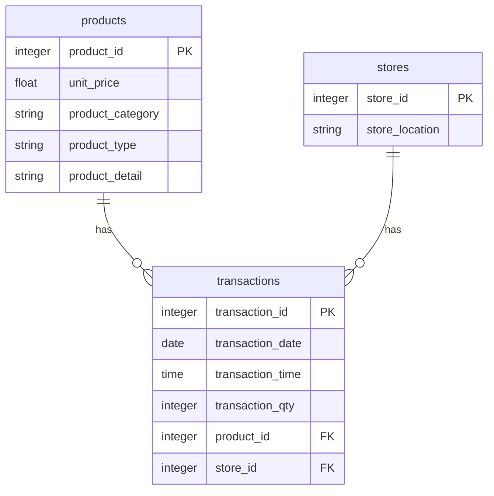

## Background information
Maven roasters is a fictional coffee shop in New York operating 3 branches.The data contains transaction data,locations and details of the products sold.
The transactions range over a period of 6 months from January 2023 to June 2023 and the data is represented by a single CSV.

Here I will discuss the findings of my analysis only, though the whole process by which I reached my conclusions will be covered seperately, which can be found here.

## Data Structure Overview
I loaded the data into PostgreSQL and normalised it into 3 tables: stores,transactions, and products.

## Executive Summary 
The records cover the sales period  01-01-2023 to 30-06-2023.
The sales started with a revenue of  $82.6k on Jan, reaching a low on Feb at $77k and, showing a general  trend of growth in the coming months with a high of $158.5k on May.

While the opposite trend was seen with the average Order value which seemed to decrease over the period Peaking in Jan at $4.77 and ending up at $4.70 in June.

## A Deep Dive into the data
All 3 branches perform relatively the same and therefore I will use total revenue only and not delve into breakdown of revenue by branch as this would be redundant.

Now as we discussed in the previous section ,AOV decreased while revenue stayed steady signifying the steady growth of order volume, this is especially evident when looking at the average monthly revenue of $108k.

Order volumes were especially high on Sundays and Mondays, probably due to increased chances of cafes being venues of socialisation on Sundays while being a cornerstone of the Monday morning rush hour.

The most performing categories of products in terms of revenue share were: 
* Coffee 38.13%
* Tea 27.76%
* Bakery 12.72%
* Drinking Chocolate 10.24%
* Coffee Beans 5.75%
These five resulted in 94% of all total generated revenue. 

After the revenue high of May, order volume dropped quite a bit going from 33.5k orders to 23.4k signifying a decrease of 30.2% in order volume.

## Recommendations

### 1. Capitalize on Sundays & Mondays

Offer limited-time promotions or award loyalty points on these high-volume days to increase AOV.

### 2. Investigate Decline in AOV

Identify the reason why lower-priced items are being sold more frequently. Since AOV drop from $4.77 to $4.70 despite increasing revenue implies a shift in customer buying behavior toward cheaper items or fewer add-ons per order.

### 3. Plan for Seasonal Lows

Understand the external influences which  caused the drop from May to June (33.5k to 23.4k orders) and mitigate with seasonal promotions or new product launches.
These influences are likely from competition or seasonal changes driving consumer choices.

### 4. Prioritize Top-Selling 
Invest more in terms of  visibility, marketing, and innovation around:
    - Coffee (38.13%)
    - Tea (27.76%)
    - Bakery (12.72%)

Since these contribute nearly 80% of revenue; optimize sourcing, bundling, and up-selling around them.

### 5. Introduce Product Bundles

This works well coupled with the previous point by creating  deals like _“Coffee + Bakery”_ or “Tea + Chocolate” for targeted upsells.
This will help drive up AOV.

### 7. Run Feedback Campaigns after May
Gather customer feedback from June to understand the 30.2% drop in orders as direct feedback can reveal product fatigue, pricing concerns, or external factors.

